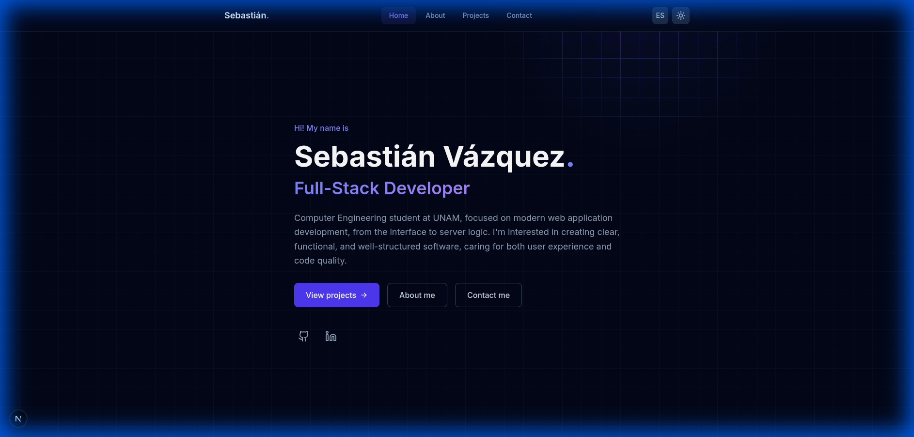

# Portfolio - Sebastián Vázquez



> **Desarrollador Full-Stack en formación** | Ingeniería en Computación @ UNAM

Este es mi portafolio personal, diseñado para mostrar mis proyectos, habilidades y experiencia. Construido con tecnologías modernas para asegurar rendimiento, accesibilidad y una experiencia de usuario premium.

## - Tech Stack

- **Framework**: [Next.js 15](https://nextjs.org/) (App Router)
- **Lenguaje**: [TypeScript](https://www.typescriptlang.org/)
- **Estilos**: [Tailwind CSS](https://tailwindcss.com/)
- **Animaciones**: [Framer Motion](https://www.framer.com/motion/)
- **Iconos**: [Lucide React](https://lucide.dev/)
- **Formularios**: [Formspree](https://formspree.io/)

## - Características

- 🎨 **Diseño Moderno**: Interfaz limpia y minimalista con un toque premium.
- 🌓 **Dark Mode**: Soporte completo para tema claro y oscuro con persistencia.
- 🌐 **Internacionalización (i18n)**: Soporte bilingüe (Español / Inglés).
- ⚡ **Animaciones Fluidas**: Transiciones de página y micro-interacciones suaves.
- 📱 **Responsive**: Totalmente adaptado a dispositivos móviles y de escritorio.
- 📧 **Contacto Funcional**: Formulario integrado con validación y feedback visual.

## - Instalación Local

1.  **Clonar el repositorio**:
    ```bash
    git clone https://github.com/itsebasvz/sebastianvz-portfolio.git
    cd sebastianvz-portfolio
    ```

2.  **Instalar dependencias**:
    ```bash
    npm install
    ```

3.  **Configurar variables de entorno**:
    Crea un archivo `.env.local` en la raíz del proyecto y añade tu ID de Formspree:
    ```env
    NEXT_PUBLIC_FORMSPREE_ID=tu_id_aqui
    ```

4.  **Correr el servidor de desarrollo**:
    ```bash
    npm run dev
    ```

5.  Abre [http://localhost:3000](http://localhost:3000) en tu navegador.

## - Despliegue

Este proyecto está optimizado para ser desplegado en [Vercel](https://vercel.com/).

1.  Importa tu repositorio en Vercel.
2.  En la configuración del proyecto, ve a **Environment Variables**.
3.  Añade la variable `NEXT_PUBLIC_FORMSPREE_ID` con tu ID de Formspree.
4.  Haz clic en **Deploy**.

## - Licencia

Este proyecto está bajo la Licencia MIT. Siéntete libre de usarlo como inspiración.

---

Hecho por [Sebastián Vázquez](https://github.com/itsebasvz)
